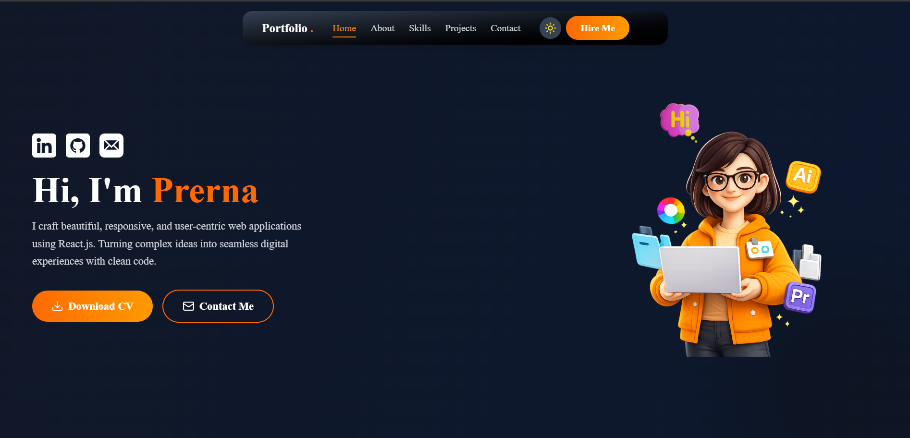
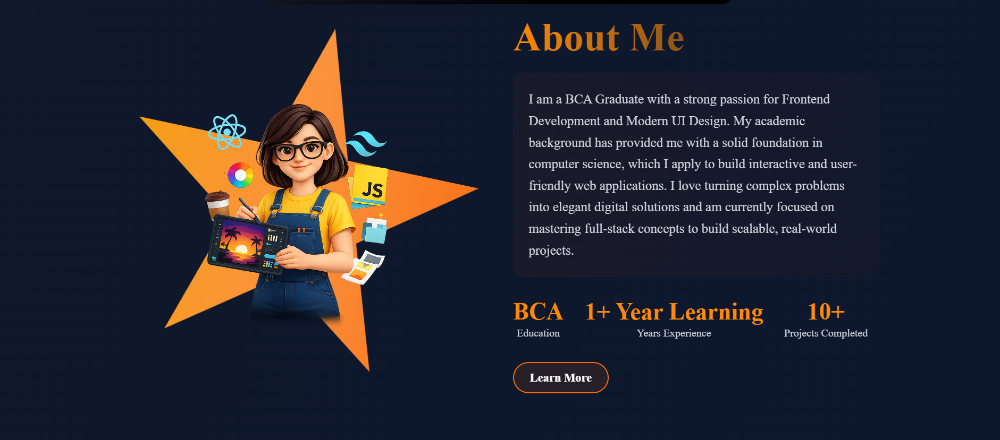
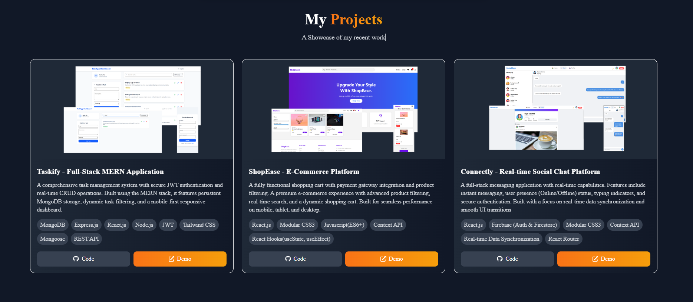

# 🚀 My Professional Portfolio

Welcome to my personal portfolio! This project showcases my journey as a **Frontend Developer**, featuring a collection of my best work, technical skills, and background.

### 🔗 Live Demo: https://my-portfolio-ashen-kappa-89.vercel.app/

---

## 📸 Previews

*Modern Hero Section with 3D Character and Animations*

*Modern About Section with 3D Character and Animations*

*Responsive Projects Showcase with Multi-Device Mockups*

---

## ✨ Key Features
- **Modern UI/UX:** Clean, dark-themed design with orange accents.
- **Fully Responsive:** Optimized for Mobile, Tablet, and Desktop screens.
- **Project Showcases:** 6 high-quality projects including MERN stack and Real-time Chat.
- **Working Contact Form:** Integrated with Formspree for direct email inquiries.
- **Animations:** Smooth scroll and reveal effects using AOS (Animate On Scroll).

---

## 🛠️ Tech Stack (Portfolio Website)
- **Frontend:** React.js, Tailwind CSS, Vite
- **State Management:** Custom Hooks
- **Animations:** AOS (Animate On Scroll)
- **Form Integration:** Formspree (Handling contact messages)
- **Icons:** React Icons / Lucide-React
- **Deployment:** Vercel, GitHub

---

## 📂 Project Structure
- `src/components`: Reusable UI components (Hero, About, Projects, etc.)
- `src/context`: Global state management logic.
- `src/assets`: Images, mockups, and icons.

---

## ⚙️ Local Setup
1. Clone the repo: `git clone [https://github.com/PrernaSingh-90/My-Portfolio.git]`
2. Install dependencies: `npm install`
3. Run dev server: `npm run dev`

---

## 📫 Connect with Me
- **LinkedIn:** https://www.linkedin.com/in/prerna-singh-299265157/
- **GitHub:** https://github.com/PrernaSingh-90/
- **Gmail:** priyasingh.sp98@gmail.com

##  👩‍💻 Author
Prerna Frontend Developer
